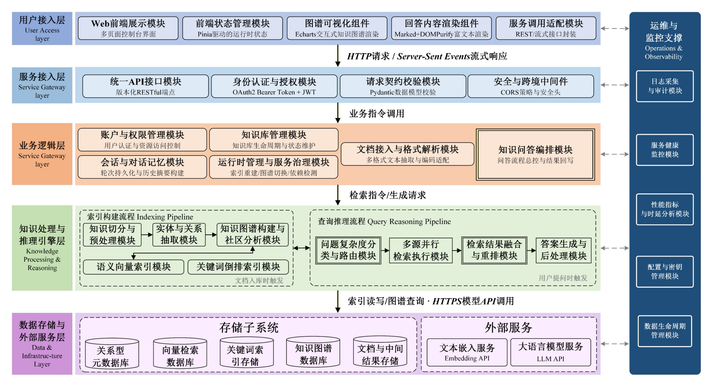
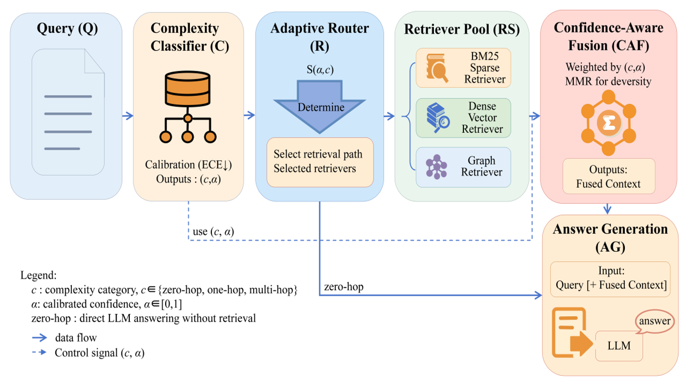
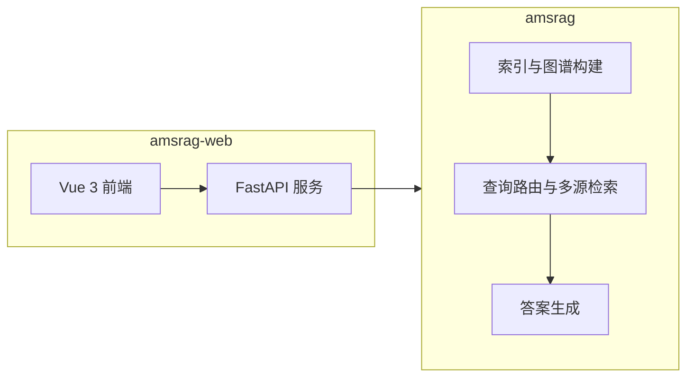

# 知源（Zhiyuan）

**基于知识图谱与多源融合检索的智能知识服务系统**

本仓库以两个子项目为核心：**`amsrag`**（检索与图谱推理引擎）与 **`amsrag-web`**（知源智答 Web 控制台：FastAPI + Vue 3）。二者在同一仓库根目录下协同工作：Web 后端在运行时会将仓库根目录加入 Python 路径，从而直接加载 `amsrag` 包。

[](https://www.python.org/downloads/)
[](LICENSE)

---

## 项目概述

知源面向「企业文档 / 个人知识库 → 可问答、可浏览的知识服务」场景，在经典 RAG 之上强化了：

- **知识图谱**：实体与关系抽取、社区结构、图谱存储（默认 NetworkX，可选 Neo4j）。
- **多源检索与融合**：向量检索（FAISS 等）、BM25、图与社区相关检索等多路召回，并经置信度感知的融合策略整合。
- **查询复杂度感知路由**：基于 ModernBERT 的复杂度分类与路由，按问题类型选择更合适的推理与检索路径（如局部实体、全局社区、朴素检索等）。

Web 层提供知识库与文档全生命周期管理、智能问答（含流式输出）、知识图谱可视化、系统设置与账户能力，便于演示、验收与本地化部署。

---

## 架构概览

**系统分层架构**（用户接入、网关、业务、知识处理与推理、存储与外部服务及运维支撑）：



**查询推理与核心算法流程**（复杂度分类与置信度、自适应路由、多源检索、置信度感知融合与答案生成）：



更细的分层说明与模块职责见 **[ARCHITECTURE.md](ARCHITECTURE.md)**。

---

## 系统组成

| 目录 | 角色 | 技术要点 |
|------|------|-----------|
| **`amsrag/`** | 核心引擎 | GraphRAG 风格流水线；复杂度分类与路由；多源检索与 CA-RRF 类融合；向量与图存储抽象及实现 |
| **`amsrag-web/`** | 应用与控制台 | FastAPI 后端；Vue 3 + Vite + Naive UI 前端；SQLite 元数据；文档解析（PDF / Word / Excel 等）；编排调用 `amsrag` |



---

## 仓库目录结构（核心部分）

```text
.
├── docs/
│   └── images/             # 架构示意图（README / ARCHITECTURE 引用）
├── amsrag/                 # Python 核心包：检索、图谱、融合、查询处理等
├── amsrag-web/
│   ├── backend/            # FastAPI、业务服务、与 amsrag 的集成
│   ├── frontend/           # Vue 3 控制台（知源智答）
│   └── data/               # 运行时数据（数据库、上传文件、RAG 工作区等，随使用生成）
├── ARCHITECTURE.md         # 架构说明
└── LICENSE
```

仓库中若还有 `examples/`、`experiments/` 等目录，用于示例脚本与实验，**不属于**上述两库的最小运行集，可按需参考。

---

## 环境要求

| 组件 | 建议 |
|------|------|
| 操作系统 | Windows 10/11（当前脚本以 Windows 为主；Linux/macOS 可按 `amsrag-web` 内说明手工启动前后端） |
| Python | **3.10+**（Web 后端与重型依赖建议一致） |
| Node.js | **16+**，配合 npm |
| 可选 | Neo4j（Aura 或自建）；不配置时默认使用 NetworkX 图后端 |

Python 依赖以 **`amsrag-web/backend/requirements.txt`** 为准（覆盖 Web 后端及与本仓库联调的引擎依赖）。

---

## 快速上手

### 方式一：启动 Web 控制台（推荐）

适用于完整体验：知识库、文档上传与处理、图谱浏览、对话问答。

1. 将本仓库克隆到本地，保证 **`amsrag`** 与 **`amsrag-web`** 位于**同一仓库根目录**（与当前布局一致）。
2. 进入 `amsrag-web/`，按该目录说明安装依赖并启动：

   - 详细步骤、环境变量（`.env`）、Neo4j 与图谱回退行为、验收建议等，请阅读 **[amsrag-web/README.md](amsrag-web/README.md)**。
   - Windows 下一键安装与启动可使用目录中的 `install.bat`、`quick-start.bat`（或 `start-all.bat`）。

3. 启动成功后，典型访问地址为：

   - 前端：`http://127.0.0.1:5173`
   - 后端 API：`http://127.0.0.1:8000`
   - OpenAPI 文档：`http://127.0.0.1:8000/docs`

首次使用需在控制台 **系统设置** 中配置大模型相关 API Key（具体提供商与模型名以后端 `.env` 与界面为准）。

### 方式二：在代码中直接使用 `amsrag`

适用于二次开发、批处理或与自有系统集成。请按 **`amsrag-web/backend/requirements.txt`** 准备 Python 环境，并保证 Python 能找到 `amsrag` 包（例如从仓库根目录运行脚本，或将根目录加入 `PYTHONPATH`）。

```python
from amsrag import GraphRAG, QueryParam

# working_dir 为引擎持久化目录（向量、图、缓存等）
rag = GraphRAG(working_dir="./amsrag_cache")

# 异步插入与查询（需在 asyncio 上下文中调用）
# await rag.ainsert(["第一段文本...", "第二段文本..."])
# result = await rag.aquery("你的问题", param=QueryParam(mode="local"))
```

`QueryParam.mode` 可与路由策略配合使用（如 `naive`、`local`、`global` 等，以当前代码与配置为准）。进阶用法可参考 `amsrag` 包内模块说明与代码中的 YAML/参数约定。

---

## 配置说明（摘要）

- **Web 与运行时**：复制并编辑 `amsrag-web/backend/.env`（模板项见 [amsrag-web/README.md](amsrag-web/README.md)）。图谱后端可通过 `RAG_GRAPH_BACKEND` 在 `networkx` 与 `neo4j` 之间切换；Neo4j 不可用时，实现上可回退到内存图或本地 GraphML（以前端与接口返回状态为准）。
- **引擎**：大模型与嵌入等配置可通过 YAML/环境变量与代码参数组合设置（具体键名以当前代码与默认配置为准）。

---

## 开发与调试

- 修改 **`amsrag`** 后，若 **Web 已启动**，通常需重启后端进程以加载新代码。
- 引擎侧示例脚本见仓库中的 **`examples/`** 目录（按需运行，注意配置 API 与路径）。

---

## 相关文档

| 文档 | 内容 |
|------|------|
| [ARCHITECTURE.md](ARCHITECTURE.md) | 分层架构、技术栈与流水线说明 |
| [amsrag-web/README.md](amsrag-web/README.md) | Web 安装、环境变量、启动方式与故障排查 |
| [amsrag/retrieval/README.md](amsrag/retrieval/README.md) | 检索与融合相关模块说明（若需深入引擎） |

---

## 许可证与致谢

- 许可证：**MIT**，见 [LICENSE](LICENSE)。
- 实现上参考并受益于社区中的 **GraphRAG** 等思路与生态；复杂度分类等能力依赖 **ModernBERT** 等模型与 Hugging Face 工具链。具体模型与数据使用请遵守各提供方的许可协议。

---

**知源 · 基于知识图谱与多源融合检索的智能知识服务系统**  
文档更新日期：2026-04-21
